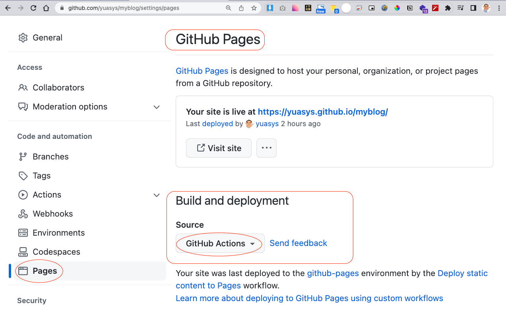

# myblog

このリポジトリはGithub-Pagesをより理解するために、いろいろ実験をやりながらその記録をしている場所です。

## これまでの経緯について

このリポジトリのはじめから現在までの経緯についていは[ここ](https://hackmd.io/@yuasys/SJuIkVHbs)に記してあります。

## 実験三昧で楽しい休日を過ごす

### githubに上げたindex.htmlを移動してみる

#### 実験前の状況

新規のパブリックリポジトリにindex.htmlをアップロードして、githubのSettings➜Pages➜Build and development➜Sourceの設定は[GitHub Actions]にしただけ、他のオプションは何もいじっていなかった。
  

ちなみにデフォルトで、Actionsに設定されていたワークフローファイル.github/workflows/pages.ymlは[ここ](https://github.com/yuasys/myblog/actions/runs/3722373156/workflow)を参照。

#### 実験の内容

index.htmlを2022-09-17/index.htmlに場所を移動し、ルートのindex.htmlにはリンクだけ置いてみた。

|/2022-09-17/index.html|
|----|

``` html
<!DOCTYPE html>
<html lang="jp">
<head>
  <meta charset="UTF-8">
  <meta http-equiv="X-UA-Compatible" ntent="IE=edge">
  <meta name="viewport" ntent="width=device-width, initial-scale=1.0">
  <title>MyBlog|Yuasys-Nob</title>
</head>
<body>
  <p><a href="2022-09-17">2022-09-17</a></p>
</body>
</html>
```

| /index.html |
|----|

``` html
  (略)

  <!-- リンク先をリモート用に設定（絶対バス）-->
  <a href="https://yuasys.github.io/myblog/">最初に戻る</a>

  <!-- リンク先をローカル用に設定（相対パス）
  <a href=".">最初に戻る</a>
  -->
  
  <br />
  <hr />
  （略）
```
#### 実験の結果

【50%成功】最初リンクだけのページが表示され、リンクを押下すると2022-09-17に移動して正しく表示できた。しかし、移動後の画面で「最初に戻る」リンクがローカル、リモートどちらかがエラーになるという不具合が発生した。  

※ローカルの場合はリンク先を相対パスで指定すればOKであった。リモートの場合は絶対パスで指定する必要があった。

#### 再発防止対策

まだ、Github Pagesの理解が不十分であったので、抜本的な改善はできなかった。ただ、真の原因は、各ページが階層構造になっている場合は、パスの表現がローカルとリモートで異なっていなければならないことだと分かったので、再発防止策は可能。  
つまり、同じディレクトリに各ページを配置することにした。
